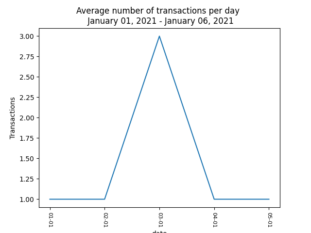

# Welcome to SuperPy

SuperPy is a command line program to keep track of transactions and inventory of a fictional supermarket.
SuperPy comes with some nifty features to help everthing get along nicely

* * *
Table of contents
- [Getting started](#getting-started)
- [Buying a product](#buying-a-product)
- [Selling a product](#selling-a-product)
- [Getting reports](#getting-reports)
  - [Inventory](#inventory)
  - [Revenue](#revenue)
  - [Profit](#profit)
  - [Expired](#expired)
  - [Overview](#overview)
  - [Transactions](#transactions)
- [Modifying date](#modifying-date)
  - [Advancing time](#advancing-time)
  - [Resetting to systemdate](#reset-date)
  - [Get current date](#get-current-date)
- [Thank you](#thank-you)
- [Appendix](#appendix)
  - [Needed files and formats](#needed-files-and-formats)

* * *

### Getting started
We can use SuperPy with the following command from the command line

>```
> usage: super.py [-h] [--advance-time ADVANCE_TIME]  {report,sell,buy} ...
>
> positional arguments:
>  {report,sell,buy}
>    report              report command
>    sell                sell command
>    buy                 buy command
> 
> optional arguments:
>  -h, --help            show this help message and exit
>  --advance-time ADVANCE_TIME
>                        specify how many day's you want to shift time, use the
>                        minus sign (-) for days to the past
>```

---
### Buying a product
---

With the following command you, as supermarkt owner, buy products for your supermarkt. 

`> usage: super.py buy [-h] -pn PRODUCT_NAME [-a AMOUNT] -p PRICE -ed EXPIRATION_DATE`  

Lets buy lemons for 25 cents a piece. The apples expiration dates is 3rd of Juni 2021.

`> python super.py buy --product-name lemons --price 0.25 --expiration-date 2021-06-03`

If you **do not pass** a `--amount [AMOUNT]` the system wil **buy** only **one** item. If you want to buy more, just pass in the argument like so:

`> python super.py buy --product-name lemons --price 0.0.25 --expiration-date 2021-06-03 --amount 19`

In the above example we have added 19 lemons to the system.

If you pass a expiration-date in the past, then **the product will not be bought** since it allready expired.

If you buy a product with the same `--product-name`, `price` and `--expiration-date` of a product that is already on record, then the amount will be added to the existing one. **Product names are case sentitive**

The sum amount of the lemons in the system after executing the two exampels above is 20, note that there is only one record because the amounts are added. When the `--product-name`, `price` or `--expiration-date` is diverent, then a new record is added.

Last thing to mention when buying products. When you are trying to enter a product with a expiration date thats in the past of the current supermarkted date, then you will be thrown a error.

---
### Selling a product
---
With the following command you, as supermarkt owner, can sell product to your customers and adjust the stock.

`> usage: super.py sell [-h] [-pn PRODUCT_NAME] [-a AMOUNT] [-p PRICE]`

Assume there is a customer that wants to buy 10 lemons for 2 euro a piece. We can do that as follow:

`> python super.py sell --product-name lemons --amount 10 --price 2`

Just as with the `buy` command you can leave out the amount. When you do that, the program will ask you if you want to sell all the apples in stock. Choose `y` and everthing wil be sold, choose `n` and the program will do nothing.

---
### Getting reports
---
#### **Inventory**

With the following command you can print reports:  

`> usage: super.py report [-h] {inventory,revenue,profit} [--now | --yesterday | --today | --date DATE]`  

Suppose we want to print out the inventory. Then we would use the following command:  

`> python super.py report inventory --now`

The reports thats follows looks like this:  

````
Inventory report
┌──────────────┬────────┬────────────┬────────────┐
│ Product Name │ Amount │ Bought for │ Expire on  │
├──────────────┼────────┼────────────┼────────────┤
│ bread        │ 1      │ 0.8        │ 2021-03-03 │
│ milk         │ 2      │ 1.1        │ 2021-04-03 │
│ appels       │ 1      │ 0.2        │ 2021-04-03 │
│ lemons       │ 10     │ 0.25       │ 2021-06-03 │
└──────────────┴────────┴────────────┴────────────┘
````

We can also print the inventory report for yesterday or a specific date in de past.

Lets [advance the time one day](#advancing-time) and sell another 5 lemons.

Now lets get a inventory for today and yesterday:

`> python super.py report inventory --now`

*Output:*
```
Inventory report
┌──────────────┬────────┬────────────┬────────────┐
│ Product Name │ Amount │ Bought for │ Expire on  │
├──────────────┼────────┼────────────┼────────────┤
│ bread        │ 1      │ 0.8        │ 2021-03-03 │
│ milk         │ 2      │ 1.1        │ 2021-04-03 │
│ appels       │ 1      │ 0.2        │ 2021-04-03 │
│ lemons       │ 5      │ 0.25       │ 2021-06-03 │
└──────────────┴────────┴────────────┴────────────┘
```

And a report for yesterday:

`> python super.py report inventory --now`

*Output:*
```
Inventory report
┌──────────────┬────────┬────────────┬────────────┐
│ Product Name │ Amount │ Bought for │ Expire on  │
├──────────────┼────────┼────────────┼────────────┤
│ bread        │ 1      │ 0.8        │ 2021-03-03 │
│ milk         │ 2      │ 1.1        │ 2021-04-03 │
│ appels       │ 1      │ 0.2        │ 2021-04-03 │
│ lemons       │ 10     │ 0.25       │ 2021-06-03 │
└──────────────┴────────┴────────────┴────────────┘
```

As you can see, after the sell we only have 5 lemons in our inventory, but yesterday we still had 10.

*Note*
*The arguments --today and --nextweek don't do anything. The system will output the same as when using the --now argument flag*

#### **Revenue**

As supermarkt owner we want to now how much money is comming in. So this program also has the ability to print out how much money has come in on a certain date. Or over a period of a month. 
Lets get the revenue for today:  

`> python super.py report revenue --today`

The output is as follows:  
```
Today's revenue so far:  11.0
```

We can also see wat is sold. [Check the overview subcommand explanation](#overview). Remember we sold 5 lemons? Lets checkout the overview of sells.

`> python super.py report overview --today`
*Output:*
```
Overview
┌──────────────┬──────────────┬─────────┬───────┬────────┐
│ Product name │ Producs sold │ Revenue │ Costs │ Profit │
├──────────────┼──────────────┼─────────┼───────┼────────┤
│ lemons       │            5 │   11.00 │  1.25 │   9.75 │
├──────────────┼──────────────┼─────────┼───────┼────────┤
│              │              │   11.00 │  1.25 │   9.75 │
└──────────────┴──────────────┴─────────┴───────┴────────┘
```

Now lets see the the revenue for 23rd of January 2020. The command:  
`> python super.py report revenue --date 2020-01-23`  

And the output:
```
Revenue from 23 Jan 2020: 0.0
```

We didn't sold anything on this date so it makes sense. but lets pretent a couple of day's (say 2) went by and we wanted the revenue of the day we only sold the lemons. Suppose that was on 2021-02-08.

We run the command:
`> python super.py report revenue --date 2021-02-08`

```
Revenue from 8 Feb 2021: 11.0
```

And it's the output is wat we expected.

When we pass a date in the format `yyyy-mm`, we can get the revenue over a that month. Lets try it for February 2021.

`> python super.py report revenue --date 2021-02`

```
Revenue from Feb 2021: 31.0
```
This makes sense since we sold 10 lemons for 2 euro a piece and 5 lemons for 2.20 a piece.

We can also make a overview, but for that see [the section on that topic](#overview)

#### **Profit**
Apart from the revenue it is also usefull to know if you can buy dinner today after a long hard day of work in the supermarket. So we can also get the profit.

Let first sell something today. Lets say we sold a bottle of milk for 2.50. We bought it for 1.10 euro. So we expect a profit of 1.40.

Remember the selling command:

`> python super.py sell --product-name milk --price 2.50 --amount 1`

Now lets check:

`> python super.py report profit --today`

The output is simple yet effective:
```
Profit: 1.40
```

As with the revenue you can also get the `profit` of yesterday, a specific date of a whole month.

*Note*
*You cannot use the --now or --nextweek argument with this command*

#### **Expired**
If we want to know which product expired and what the loss is because we didn't sell the products we can use the following command
*Note: I manualy set the expirement date of the bread to 2021-01-03*

`> python super.py report expired --now`

The output is a table in which you can see which product expired, how many items per product and what the loss is.

```
Expired report
┌──────────────┬────────────────────┬──────────────┬────────────┐
│ Product Name │ Number of products │ Loss in euro │ Expired on │
├──────────────┼────────────────────┼──────────────┼────────────┤      
│ bread        │                  1 │         0.80 │ 2021-01-03 │
├──────────────┼────────────────────┼──────────────┼────────────┤
│              │                    │         0.80 │            │
└──────────────┴────────────────────┴──────────────┴────────────┘
```

In the above example we didn't sell enough bread, so we have a loss of 0.80 euro.

We can also see which products go bad in de comming seven day's with the command:
*Note: I manualy set the expirement date of the bread to 2021-02-15*

`> python super.py report expired --nextweek`

The result looks the same, but now we can see which products are going bad in de coming week. Handy feature to see if something needs to be in sale to prevent unnessary loss due to expiration.

```
Expired report
┌──────────────┬────────────────────┬──────────────┬────────────┐
│ Product Name │ Number of products │ Loss in euro │ Expired on │
├──────────────┼────────────────────┼──────────────┼────────────┤
│ appels       │                  1 │         0.20 │ 2021-02-15 │
├──────────────┼────────────────────┼──────────────┼────────────┤
│              │                    │         0.20 │            │
└──────────────┴────────────────────┴──────────────┴────────────┘
```

*Note*
*We cannot use the --today, --yesterday or --date flag yet*

### **Overview**

We already have seen some examples of the output of this function. But here you can learn more about it.  

If we want to know wat we products we sold at a particular day, then we can use the command:

`usage: super.py report overview [--now | --yesterday | --today | --nextweek | --date DATE]`

*sidenote: the `--now` and the `--today` flag give the same results*

So we want to know what we sold on the following date 2021-02-05. We can do that with the command:

`> python super.py report overview --date 2021-02-08`

Below you can see the output of this command, as seen before

```
Overview
┌──────────────┬──────────────┬─────────┬───────┬────────┐
│ Product name │ Producs sold │ Revenue │ Costs │ Profit │
├──────────────┼──────────────┼─────────┼───────┼────────┤
│ lemons       │            5 │   11.00 │  1.25 │   9.75 │
├──────────────┼──────────────┼─────────┼───────┼────────┤
│              │              │   11.00 │  1.25 │   9.75 │
└──────────────┴──────────────┴─────────┴───────┴────────┘
```

As you can see, we get a overview in and we can see wat we sold, and what the revenue, costs and profit per product and totals for the requested day.

If you want a overview of the month February, you can format the date by `yyyy-mm` like in the example below.

`> python super.py report overview --date 2021-02`

This results in the following report. Maybe you can remember wat we sold in this manual. If not, we can see it below.

```
Overview
┌──────────────┬──────────────┬─────────┬───────┬────────┐
│ Product name │ Producs sold │ Revenue │ Costs │ Profit │
├──────────────┼──────────────┼─────────┼───────┼────────┤
│ lemons       │           15 │   31.00 │  3.75 │  27.25 │
│ milk         │            1 │    2.50 │  1.10 │   1.40 │
├──────────────┼──────────────┼─────────┼───────┼────────┤
│              │              │   33.50 │  4.85 │  28.65 │
└──────────────┴──────────────┴─────────┴───────┴────────┘
```

#### **Transactions**

We can also evaluate the transaction. As supermarkt manager you can plot data concerning the average-amount spend bij customers per day per transactions. And we can also plot the number of transactions per day given a certain period. Both will be explaind below

```
usage: super.py transaction [-h] (--average-amount | --number-of-transactions) (--all | --current-month | --current-year | --previous-month | --previous-year)

optional arguments:
  -h, --help            show this help message and exit
  --average-amount
  --number-of-transactions
  --all                 get all the transactions
  --current-month       only get transactions for current month
  --current-year        only get transactions for current year
  --previous-month      only get transactions for previous month
  --previous-year       only get transactions for previous year
```

So wen we want to know the average amount spend per transaction over the current month we can use the command:

`> python super.py transaction --average-amount --current-month `

The result wil be a graph as you can see below (depending on the data in your files off-course):


We can also do this for all the data in de current year bij using the flag `--current-year` instead of `--current-month`.  
The `--all` flag ensures that all the sales in the datafile are taken into account wen creating the plot.  
Finally we can use the `--previous-month` or the `--previous-year` flag if we want to see the data of that time period.
When there is no data to display you will get a message in your terminal.

Next to the spending amount we can see if it was busy. We can plot the number of transactions bij issueing the command:

`> python super.py transaction --number-of-transactions --all`

That wil result in the following plot.



The periods over which this command can display the data are the same as with the `--average-amount` flag.

---
### Modifying date
---
#### **Advancing time**
For testing purposes we can advance the date. We do that with the following command:

`> usage: super.py [-h] [--advance-time ADVANCE_TIME]`

ADVANCE_TIME is in day's, so if we want to advance the time for 2 day's we can use the next command:

`> python super.py --advance-time 2`

If we want to reset the date to the system date we can pass any negative value. For example:

`> python super.py --advance-time -1`

#### **Reset date**
To set the date to the systemdate quickly we can use the command:

`> usage: super.py [-h] [--date-to-sysdate]`

So if you want to set the date to the system date:

`> python super.py --date-to-sysdate`


#### **Get current date**
The system can tell you what it perceives as the current date with the command:

`> python super.py --tell-current-date`

---
### Thank you
---
Thank you for reading the manual. If you came across bugs or if you have feature requests please let me know. This is my first command-line program so any feedback is welcome.

---
### Appendix
---

#### **Needed files and formats**

The files are saved in the data folder.

date.txt
: The date of the system is stored in the `date.txt` file as a string conforming to the iso format `yyyy-mm-dd`.

sold.csv
: The `sold.csv` file keeps track of the sells made by the supermarket. The file is located in the data folder.  
Columns needed in the `sold.csv` file are in order:  
`> id,product_id,selling_count,selling_date,selling_price`

bought.csv
: The `bought.csv` file keepts track of the purchases made by the supermarket. The file is located in the data folder.  
Column needed in the `bought.csv` file are:  
`> id,product_name,purchase_count,purchase_price, expiration_date,purchase_date`
